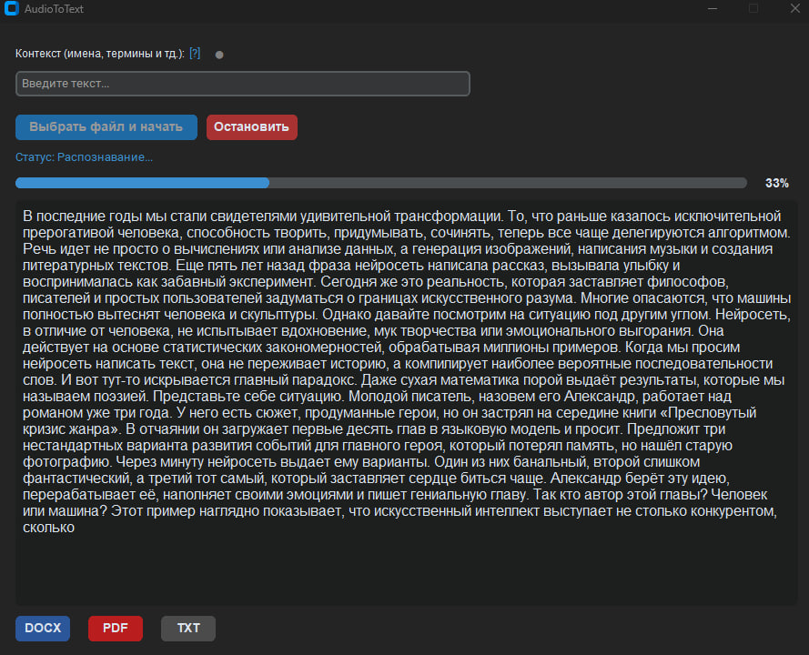

# AudioToText (Whisper-based)



Desktop application for automated audio-to-text transcription using the `faster-whisper` engine.

## Overview
The tool provides a graphical interface to transcribe audio/video files locally. It utilizes CTranslate2 inference engine for optimized performance on CPU.

## Features
- **Engine:** Faster-Whisper (OpenAI Whisper optimized with CTranslate2).
- **Quantization:** `int8_float32` for efficient CPU usage.
- **Context Support:** Allows passing initial prompts to improve recognition of specific terms and names.
- **VAD Filter:** Integrated Voice Activity Detection to ignore silent segments.
- **Export:** Supports DOCX, PDF, and UTF-8 TXT formats.

## Tech Stack
- Python 3.10+
- faster-whisper
- customtkinter
- python-docx, fpdf2
- platformdirs, imageio-ffmpeg

## Installation & Setup

1. **Clone the repository:**
   ```bash
   git clone https://github.com/prestoles/voice_to_text.git
   cd voice_to_text
   ```
2. **Install requirements:**
    ```bash
    pip install -r requirements.txt
    ```
3. **Run:**
    ```bash
    python main.py
    ```

### Notes
- **Models**: the app will use a bundled `models/<name>` folder if present (e.g. in a packaged build). Otherwise, models are downloaded and cached in a **user-writable** directory (via `platformdirs`) so it works reliably with PyInstaller.
- **Media formats**: for `.mp3`, `.mp4`, `.mkv`, `.m4a`, etc. decoding typically requires **ffmpeg**. The app will use `ffmpeg` from your system `PATH` if available, or fall back to the bundled binary provided by `imageio-ffmpeg` (installed from `requirements.txt`).

## Implementation Details
- **Threading:** Transcription runs in a background thread to keep the GUI responsive.
- **Path Handling:** Compatible with PyInstaller (`sys._MEIPASS`) for standalone executable builds.
- **UI:** Event-driven architecture with real-time text streaming.